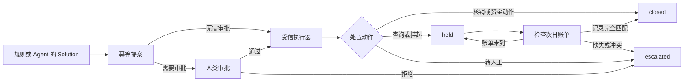

# 阶段 7：高风险处置闭环

阶段 7 把求解方输出的 `Solution` 接到真实状态流上，同时守住三条边界：

1. 模型和规则只能提案，不能审批；
2. 人类审批人必须满足角色阈值，且不能审批自己的提案；
3. `SUPPLEMENT` / `REVERSAL` 只能由 `service:<name>` 账户执行。

实现位于 `recon/workflow.py`。它复用现有 `adjustments`、`approvals`、
`ledger_entries` 和 `recon_diffs`，没有引入通用工作流引擎。

## 状态流



复合差错可能生成多个提案。终态按 `escalated > held > closed` 合并，因此执行顺序
不会把已经挂起或升级人工的差错重新降成关闭。

## 提案边界

`propose_solution()` 是求解层与处置层之间的连接点：

- 校验 `solution.task_id` 与 `diff_id` 一致；
- 调账金额只从 `recon_diffs.diff_cents` / `fee_delta_cents` 派生，模型不能自报金额；
- `UNKNOWN` 自动收敛为 `ESCALATE`；
- D10、D12、D16、D17 只能生成 `ESCALATE`；
- 多动作提案放在同一原子段里，任意一个失败则全部回滚。

直接调用 `propose_adjustment()` 时仍会重复执行同样的禁止规则，不能绕过桥接层。

## 审批矩阵

最低角色继续以 `recon/config.py` 和 `recon/policies/adjustment_auth.md` 为准：

| 动作 | 最低审批要求 |
|---|---|
| AUTO_WRITEOFF | 按金额阈值 |
| SUPPLEMENT | 按金额阈值 |
| REVERSAL | 按金额阈值，最低为 `finance` |
| HOLD_NEXT_BILL / CHANNEL_INQUIRY / DISCARD_DUPLICATE / ESCALATE | 无需审批 |

审批身份必须是 `human:<name>`。模型、规则与服务账号无法调用审批路径；提案人与
审批人相同也会被拒绝。审批一旦进入 `approved` 或 `rejected`，重放同一决定只返回
首次结果，任何不同决定都不能覆盖既有审计记录。

当前项目按“后端工程做薄”的约定，由调用方的身份适配层提供已经认证的角色。
真实生产环境还需要把 `human:<name>` 和 `actor_role` 接到企业身份系统；本项目没有
伪装成完整 RBAC。

## 幂等与原子执行

规范幂等键为：

```text
diff_id:action:approval_id
```

无需审批的动作以 `NO_APPROVAL` 作为最后一段。同一差错、同一动作的提案重放会返回
原记录；若金额、归因或提案人发生变化，则报告 `IdempotencyConflict`，不会静默覆盖。

执行采用 SQLite savepoint，以下变化在同一个原子段内完成：

- `adjustments.executed_count` 从 0 变为 1；
- 资金动作写入一借一贷两条 `ledger_entries`；
- `recon_diffs.status` 进入终态；
- 审计元数据记录执行身份和时刻。

任何一步失败都会回滚。成功执行后的重放不会再次写分录，`INV3` 与 `INV4` 会继续检查
执行次数和借贷平衡。

## 挂起后的次日恢复

`resume_held_adjustment()` 只处理已经执行的 `HOLD_NEXT_BILL`：

1. 以原账单日加一天得到待检查账单日；
2. 只读取 `received_at <= as_of` 的账单，避免未来信息泄漏；
3. 账单未到时保持 `held`；
4. D21 类缺失明细要求流水号、类型和 gross 金额完全匹配；
5. D22 类手续费更正还要求渠道手续费与我方手续费相等；
6. 次日账单已经收到但记录缺失或不一致时进入 `escalated`。

恢复检查只改变差错状态和审计信息，不增加 `executed_count`，重复检查仍然安全。

## 验收

专项测试覆盖：

- 提案重放与幂等载荷冲突；
- 未审批动账、模型审批、自批、角色不足；
- 资金动作只能由服务账户执行；
- 执行中途失败的全量回滚；
- 一借一贷和 `executed_count = 1`；
- 绝对禁止自动处置的四类差错；
- UNKNOWN 的 fail-safe；
- 复合动作终态合并；
- 次日账单未到、正确补发、缺失、金额冲突、费率未更正；
- 审批拒绝后的不可改写。

运行：

```bash
PYTHONPATH=. TMPDIR=/private/tmp conda run -n agent \
  python -m pytest tests/test_workflow.py -q
```
